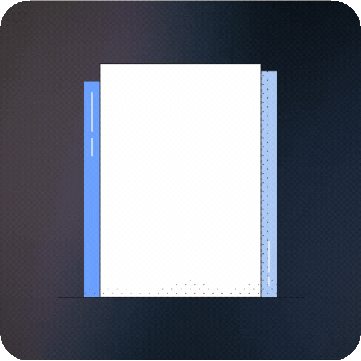

# prompt-lockbox 

&nbsp;&nbsp;&nbsp;***Your friendly AI toolkit for storing, managing, and supercharging prompts!***

&nbsp;&nbsp;&nbsp; `PromptLockbox brings structure and reproducibility to prompt engineering by`
&nbsp;&nbsp;&nbsp; `treating prompts as code`
&nbsp;&nbsp;&nbsp; `This toolkit lets you version, secure, and scale your entire prompt library,` 
&nbsp;&nbsp;&nbsp; `complete with integrity locking, advanced semantic search, and AI-powered quality improvements.`
  
   

Some content 
